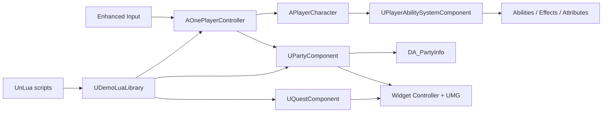

# UE5 Action RPG Technical Demo

Unreal Engine 5.6 action RPG demo built with C++, Blueprint/UMG, Gameplay Ability System, Enhanced Input, networking, and UnLua.

[中文](#中文) | [English](#english)

## 中文

这是一个用于展示 UE5 Gameplay 工程能力的动作角色扮演项目。C++ 负责权威状态、生命周期、输入模式、暂停规则、网络判断和核心行为；Blueprint/UMG 负责资产配置、布局、动画和视觉反馈；Lua 只通过稳定的 C++ 白名单接口参与流程编排，不复制核心状态。

### 主要功能

- **Gameplay Ability System**：属性、伤害、Gameplay Effect、技能授予、输入标签和冷却由 GAS 驱动。
- **四槽队伍系统**：支持选择目标槽位、替换未入队角色、交换已入队角色，以及服务端校验后的编队应用。
- **运行时角色切换**：数字键 `1` 至 `4` 切换有效队伍成员，完成 Spawn、Possess、动画初始化、旧 Pawn 清理和角色技能集替换。
- **事件驱动 HUD**：队伍头像、属性、任务追踪和 E/R 技能图标根据权威状态刷新，不创建第二套 HUD 状态。
- **队伍配置界面**：C++ 保存待确认编队和选中槽位，UMG 负责槽位、角色卡和交互反馈。
- **3D 队伍预览**：使用共享的 `SceneCapture2D` 舞台和运行时 Render Target 展示四名待确认成员。
- **暂停菜单**：`Esc` 打开暂停菜单，包含继续、设置、返回主菜单和退出游戏；破坏性操作需要二次确认。
- **任务、背包与经验**：独立组件维护运行时状态，并通过委托通知 UI。
- **UnLua 边界层**：Lua 通过 `UDemoLuaLibrary` 调用现有控制器和组件接口，不直接写复制数组或持有关键 UObject 生命周期。

### 架构与数据流



`AOPlayerState` 持有需要跨 Pawn 生命周期保留的 Ability System、队伍、任务和经验组件。`AOnePlayerController` 管理角色切换、队伍提交、受控 UI 页面和暂停菜单。角色切换时，控制器从队伍数据解析目标角色类，在权威端生成并 Possess 新 Pawn，然后重新绑定 HUD 和角色技能。

`UPartyComponent` 是有效编队的权威写入端。固定长度槽位保留空位索引，避免 UI、数字键和网络复制因为数组压缩而错位。客户端提交的新编队必须经过 C++ 校验；Blueprint 和 Lua 不直接修改 `ActivePartyTags`。

### 队伍与 HUD 更新

队伍配置页遵循以下交互契约：

1. 点击队伍槽位只选择目标位置。
2. 点击未入队角色会放入或替换当前槽位。
3. 点击已位于其他槽位的角色会交换两个槽位。
4. 点击当前槽位中的同一角色不会改变数组。
5. 确认后由服务端校验并应用，HUD 最终只根据有效队伍状态重建。

主界面头像类在首次重建时从设计期模板缓存，之后即使容器已经执行 `ClearChildren()`，仍可根据当前队伍重新创建头像。角色切换复用当前可见 Overlay，并重新绑定当前 Pawn 的 Ability System 数据，因此队伍头像和技能图标都跟随当前角色更新。

### 暂停菜单

暂停状态、页面状态、输入阻断、主菜单跳转和退出行为由 `AOnePlayerController` 管理。`UPauseMenuWidget` 只转发按钮命令并呈现 Main、Settings 和 Confirmation 页面。对话、死亡界面和其他受控菜单与暂停菜单共享统一的输入模式管理，避免重复 Widget 和相互冲突的鼠标状态。

### 输入

| 输入 | 行为 |
|---|---|
| `WASD` | 移动角色 |
| 鼠标 | 控制镜头 |
| `1` - `4` | 切换有效队伍槽位 |
| `L` | 打开或关闭队伍配置页 |
| `Esc` | 打开、返回或关闭暂停菜单 |
| `E` / `R` | 触发当前角色技能 |

具体映射由 Enhanced Input 资产配置；C++ 只绑定并执行对应行为。

### 目录结构

```text
Demo/
|-- Config/                         项目配置、Gameplay Tags 和 UMG 布局数据
|-- Content/_Game/BluePrints/       角色、技能、输入、UI 和 Data Asset
|-- Content/Script/Demo/            UnLua 模块
|-- Plugins/UnLua/                  UnLua 项目插件
|-- Source/Demo/Public/             公共类型和反射 API
|   |-- AbilitySystem/              GAS 能力、属性和数据
|   |-- Components/                 队伍、任务、背包和经验
|   |-- Player/                     PlayerState 与 PlayerController
|   |-- Scripting/                  Lua/Blueprint 稳定门面
|   `-- UI/                         HUD、菜单和队伍控件
`-- Source/Demo/Private/            系统实现
```

### 可选 UMG 布局工具

项目中的 `Config/UMGLayouts` 保存 JSON 布局快照和补丁。对应编辑器插件 **UMG Codex Batch Designer** 使用独立仓库维护，不作为父项目中的普通源码目录提交：

```powershell
git clone https://github.com/LordFulilian/UMGJsonLayoutTool.git `
  Plugins/UMGJsonLayoutTool
```

插件仓库：[LordFulilian/UMGJsonLayoutTool](https://github.com/LordFulilian/UMGJsonLayoutTool)

### 环境与构建

要求：

- Unreal Engine 5.6
- Visual Studio 2022，安装 Desktop development with C++
- 与 UE 5.6 兼容的 MSVC 和 Windows SDK
- 完整的 `Plugins/UnLua` 目录

生成项目文件后可构建 Development Editor：

```powershell
& "D:\Program Files\UE_5.6\Engine\Build\BatchFiles\Build.bat" `
  DemoEditor Win64 Development `
  "-Project=D:\Program Files\Unreal Projects\Demo\Demo.uproject" `
  -WaitMutex -NoHotReloadFromIDE
```

打包配置包含 `Map_MainMenu` 和 `StartMap`。提交前应在本机完成 C++ 编译，并在 Unreal Editor 中编译受影响的 Widget Blueprint、执行 PIE 和检查 Output Log；`.uasset` 的运行时行为不能仅通过文本静态检查确认。

### 当前限制

- 队伍解锁和编队状态目前以运行时状态为主，跨启动持久化仍需要接入 `USaveGame`。
- 网络路径保留服务端权威和 Owner-only 复制结构，但仍需要专门的多人 PIE 与延迟环境测试。
- UMG 布局和视觉资产需要在 Unreal Editor 中验证，仓库不包含打包后的游戏或演示视频。

---

## English

This repository is an Unreal Engine 5.6 action RPG technical demo. C++ owns authoritative gameplay state, lifecycle, input modes, pause rules, networking decisions, and core behavior. Blueprint/UMG owns asset configuration and presentation. Lua is limited to orchestration through stable reflected C++ APIs and does not duplicate gameplay state.

### Highlights

- **Gameplay Ability System** for attributes, damage, Gameplay Effects, ability grants, input tags, and cooldowns.
- **Four-slot party formation** with target-slot selection, replacement, swapping, validation, and authoritative application.
- **Runtime character switching** through spawn, possession, animation initialization, old-pawn cleanup, and character-specific ability replacement.
- **Event-driven HUD refresh** for party portraits, attributes, quests, and E/R ability icons.
- **Native party setup flow** where C++ owns pending formation state and UMG presents slots, hero cards, and feedback.
- **3D party preview** rendered through one shared `SceneCapture2D` stage and transient render target.
- **Pause menu** with continue, settings, return-to-main-menu, exit, and confirmation states.
- **Quest, inventory, and experience components** with delegate-driven UI updates.
- **UnLua facade** through `UDemoLuaLibrary`, preserving C++ authority and UObject lifecycle ownership.

### Runtime ownership

`AOPlayerState` owns the Ability System and player components that must survive pawn replacement. `AOnePlayerController` owns party switching, formation submission, managed screens, and pause-menu state. `UPartyComponent` is the authoritative writer for the active formation; Blueprint and Lua never write `ActivePartyTags` directly.

The party uses a fixed-size slot array so empty positions retain stable indices for UI, number keys, and replication. Formation changes are validated in C++ before application. The visible overlay rebuilds portraits from authoritative party state and rebinds ability metadata after possession, keeping skill icons synchronized with the active character.

### Controls

| Input | Action |
|---|---|
| `WASD` | Move |
| Mouse | Camera control |
| `1` - `4` | Switch to an occupied party slot |
| `L` | Toggle party setup |
| `Esc` | Open, navigate back, or close the pause menu |
| `E` / `R` | Activate current character abilities |

Enhanced Input assets define the concrete mappings; C++ binds and executes the behavior.

### Optional UMG layout tool

`Config/UMGLayouts` contains JSON layout snapshots and patches. The matching **UMG Codex Batch Designer** editor plugin is maintained as a separate repository:

```powershell
git clone https://github.com/LordFulilian/UMGJsonLayoutTool.git `
  Plugins/UMGJsonLayoutTool
```

Plugin repository: [LordFulilian/UMGJsonLayoutTool](https://github.com/LordFulilian/UMGJsonLayoutTool)

### Build

Install Unreal Engine 5.6 and Visual Studio 2022 with Desktop development with C++, then generate project files and build the Development Editor target:

```powershell
& "D:\Program Files\UE_5.6\Engine\Build\BatchFiles\Build.bat" `
  DemoEditor Win64 Development `
  "-Project=D:\Program Files\Unreal Projects\Demo\Demo.uproject" `
  -WaitMutex -NoHotReloadFromIDE
```

The packaging configuration includes `Map_MainMenu` and `StartMap`. Before release, compile affected Widget Blueprints in Unreal Editor, run PIE, and inspect the Output Log. Binary `.uasset` behavior cannot be fully verified through text-only static checks.

### Known limitations

- Party unlocks and formation are primarily runtime state; cross-session persistence still requires a `USaveGame` layer.
- The server-authoritative and owner-only replication paths still require dedicated multiplayer PIE and latency testing.
- The repository does not include packaged builds, promotional videos, or personal resume material.
